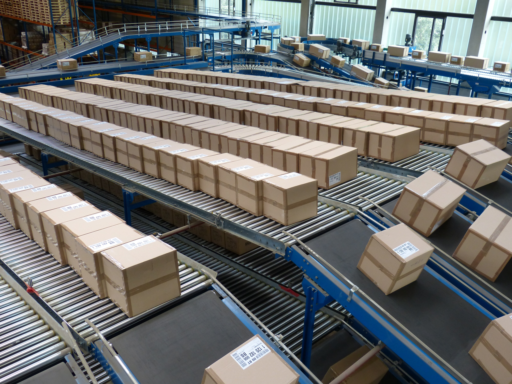
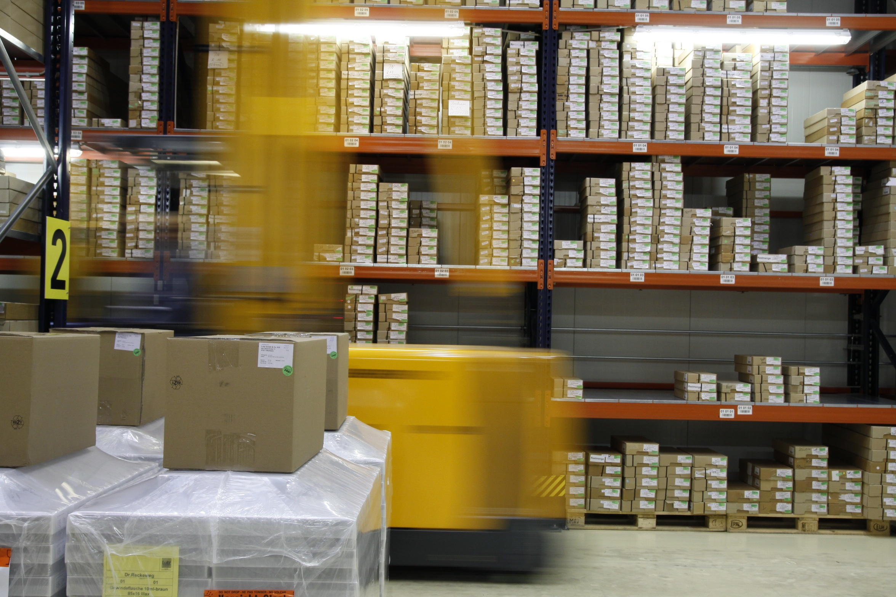
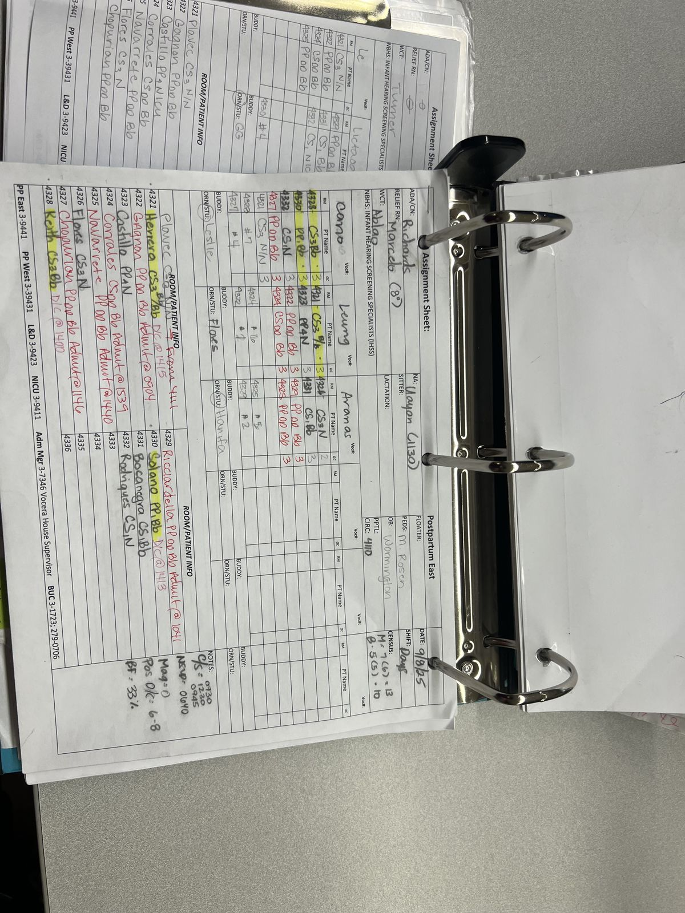
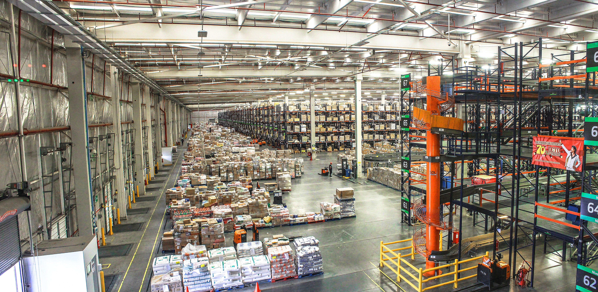

# Task 3: Site Visit Report - Vereeniging Warehouse

**Date:** 2026-09-17

## 1. Introduction
For Task 3, our group needed to look at how a typical municipal warehouse operates so we could identify the problems our AI solution (Stockwise AI) needs to fix. We gathered visual references to understand the current manual systems used in warehouses like the ones in Vereeniging. The pictures below show what we found regarding the storage layout, paper-based tracking, and distribution areas.

## 2. Pictures of the Warehouse Setup

### Storage and Shelving

*Figure 1: Warehouse shelves with mixed stock. Items are just placed wherever there is space.*

*Figure 2: Factory packaging area. Fast-moving items are not kept near the dispatch area.*

### Manual Record-Keeping

*Figure 3: Supermarket stock packaging. Inventory is counted by hand.*

*Figure 4: A manual logbook used to record stock. It's easy to make mistakes here.*

*Figure 5: A worker checking stock with a clipboard. This takes a lot of time.*

### Distribution Area

*Figure 6: The distribution area. Forklifts have to travel far because of the layout.*

## 3. What We Observed
Looking at these pictures, we noticed a few big problems that match what we read about municipal warehouses:

1. **No Real-Time Visibility:** Because everything is written in logbooks and clipboards (Figures 4 and 5), no one knows exactly what is in stock right now. 
2. **Paper-Based Tracking:** The manual logbooks are hard to read, easy to lose, and difficult to audit. This is where theft and misplacement happen.
3. **Bad Layout:** Stock is mixed together on the shelves (Figures 1 and 2). Forklifts have to travel long distances because fast-moving items are not placed near the exit.
4. **Expiry Issues:** There is no automated system to warn staff about expired goods, which leads to waste.

## 4. How This Links to Stockwise AI
These observations directly show why we need our system. Here is how Stockwise AI fixes each problem:

*   **Mixed storage** -> Fixed by Intelligent Slotting (K-Means + Genetic Algorithm) to put fast items near the front.
*   **Manual logbooks** -> Fixed by Computer Vision stock-taking, which removes the need for paper.
*   **Long travel times** -> Fixed by Slotting optimisation, saving time and fuel.
*   **Untracked expiry** -> Fixed by Predictive Analytics, which automatically warns staff before items expire.

## 5. Conclusion
The pictures confirm that the current manual system is slow, prone to errors, and makes service delivery difficult. Stockwise AI will automate the stock-taking and give managers real-time, accurate data.
